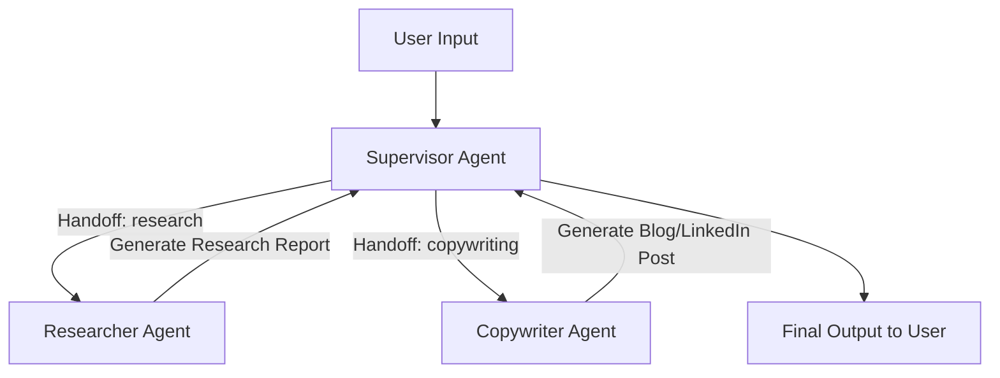

# 🌟 **TriMind AI — Multi-Agent Collaboration System**
*A fully autonomous Researcher + Copywriter + Supervisor workflow built using LangGraph & OpenAI.*

## 🚀 **Overview**

**TriMind AI** is a modular, production-grade **multi-agent system** designed to automate complex workflows like:

✔ Researching topics  
✔ Writing LinkedIn posts or blogs  
✔ Coordinating agents with a Supervisor  
✔ Persisting memory & research reports  
✔ Able to run as a CLI tool or backend component  

This system uses:

- **LangGraph** for agent routing  
- **OpenAI GPT-4o-mini** for reasoning  
- **Tavily** for web research  
- **Tool calling** for report generation, blog generation, LinkedIn posts  
- **Persistent memory** via LangGraph MemorySaver  

---

## 🧠 **How It Works (High-Level Flow)**



---

## 🏗️ **Project Structure**

```
TriMind-AI/
│
├── .git/
├── .venv/
├── __pycache__/
├── ai_files/                 
├── example_content/
│   ├── linkedin.md
│   └── blog.md
│
├── prompts/
│   ├── researcher.md
│   ├── copywriter.md
│   └── supervisor.md
│
├── trimind_ai.egg-info/
│
├── .env                      
├── .gitignore
├── .python-version
│
├── copywriter.py             
├── researcher.py             
├── supervisor.py             
├── utils.py                  
│
├── main.py                   
├── pyproject.toml            
├── uv.lock
│
└── README.md 
```

---

## 🧩 **Core Components**

### 🔬 **1. Researcher Agent**
- Performs web search using **TavilySearch**
- Extracts webpage content using **TavilyExtract**
- Generates structured **Research Reports**
- Shares reports with other agents

### ✍️ **2. Copywriter Agent**
- Uses research reports  
- Generates:
  - LinkedIn posts  
  - Blog posts  
- Saves output to `/ai_files/*.md`

### 🎯 **3. Supervisor Agent**
- Manages entire workflow  
- Uses tool calling to direct tasks  
- Handles recursion-safe routing  

---

## ⚙️ **Installation**

```bash
git clone https://github.com/ShubhamJadhav03/TriMind-AI.git
cd TriMind-AI
python -m venv .venv
source .venv/bin/activate   # or .venv\Scripts\activate on Windows
pip install .
```

Add `.env`:

```
OPENAI_API_KEY=your_key
TAVILY_API_KEY=your_key
```

---

## ▶️ **Running TriMind AI**

```bash
python main.py
```

Example prompt:

```
Write a LinkedIn post on the top AI tools small businesses should use.
```

---

## 🖼️ **Architecture Diagram**


---

## 🤝 **Contributing**
Pull requests are welcome!

## 📜 **License**
MIT License.

## 🙌 **Credits**
Built by **Shubham Jadhav**.
